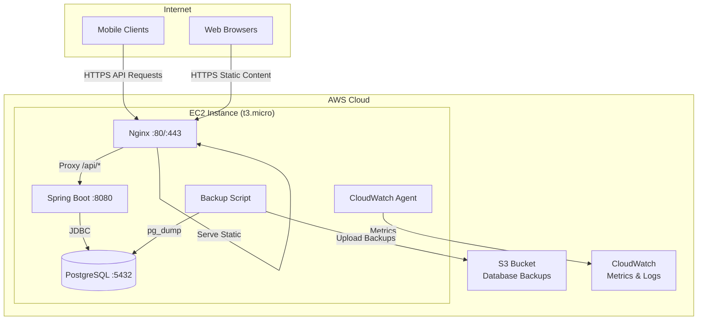

# Design Document

## Overview

This design describes a single EC2 instance infrastructure that hosts a Java Spring Boot REST API backend, PostgreSQL database, and Nginx reverse proxy. The architecture prioritizes simplicity, cost-effectiveness, and AWS Free Tier compatibility while supporting offline-first mobile applications.

The system follows a monolithic deployment model where all server components run on a single EC2 instance. This approach minimizes operational complexity and costs, making it ideal for early-stage applications or proof-of-concept deployments.

## Architecture

### High-Level Architecture



### Component Deployment

All components run on a single EC2 instance:
- **Nginx** listens on ports 80 (HTTP) and 443 (HTTPS)
- **Spring Boot** listens on port 8080 (localhost only)
- **PostgreSQL** listens on port 5432 (localhost only)
- **CloudWatch Agent** runs as a system service
- **Backup Script** runs via cron job

### Network Architecture

- EC2 instance deployed in a public subnet with an Elastic IP
- Security Group allows inbound traffic on ports 80 and 443 only
- All internal communication (Nginx→Spring Boot, Spring Boot→PostgreSQL) occurs via localhost
- Outbound traffic allowed for package updates, S3 uploads, and CloudWatch metrics

## Components and Interfaces

### 1. Nginx Reverse Proxy

**Purpose**: Route incoming requests, serve static content, and provide SSL termination

**Configuration**:
```nginx
server {
    listen 80;
    listen 443 ssl;
    server_name example.com;

    # SSL configuration
    ssl_certificate /etc/nginx/ssl/cert.pem;
    ssl_certificate_key /etc/nginx/ssl/key.pem;

    # Static content
    location / {
        root /var/www/html;
        index index.html;
        try_files $uri $uri/ =404;
    }

    # API proxy
    location /api/ {
        proxy_pass http://localhost:8080/api/;
        proxy_set_header Host $host;
        proxy_set_header X-Real-IP $remote_addr;
        proxy_set_header X-Forwarded-For $proxy_add_x_forwarded_for;
        proxy_set_header X-Forwarded-Proto $scheme;
    }

    # Health check endpoint
    location /health {
        proxy_pass http://localhost:8080/actuator/health;
    }
}
```

**Responsibilities**:
- SSL/TLS termination
- Request routing based on path
- Static file serving
- Request header forwarding
- Connection pooling to backend

### 2. Spring Boot Backend

**Purpose**: REST API server for mobile client synchronization

**Technology Stack**:
- Java 17 or 21 (LTS versions)
- Spring Boot 3.x
- Spring Data JPA for database access
- Spring Web for REST endpoints
- PostgreSQL JDBC driver

**Key Components**:

**Application Configuration** (`application.yml`):
```yaml
server:
  port: 8080
  address: 127.0.0.1  # Bind to localhost only

spring:
  datasource:
    url: jdbc:postgresql://localhost:5432/appdb
    username: ${DB_USERNAME}
    password: ${DB_PASSWORD}
    hikari:
      maximum-pool-size: 10
      minimum-idle: 2
      connection-timeout: 30000
      
  jpa:
    hibernate:
      ddl-auto: validate
    show-sql: false
    properties:
      hibernate:
        dialect: org.hibernate.dialect.PostgreSQLDialect
        
management:
  endpoints:
    web:
      exposure:
        include: health,info,metrics
  endpoint:
    health:
      show-details: when-authorized
```

**REST API Endpoints**:
- `POST /api/sync/push` - Client pushes new/updated entries
- `GET /api/sync/pull` - Client fetches updated entries since timestamp
- `GET /api/health` - Health check endpoint
- `GET /actuator/health` - Spring Boot actuator health (optional)

**Service Layer Architecture**:
```
Controller Layer (REST endpoints)
    ↓
Service Layer (Business logic, conflict resolution)
    ↓
Repository Layer (Spring Data JPA)
    ↓
PostgreSQL Database
```

**Project Structure**:
```
myapp/
├─ pom.xml
├─ src/main/java/com/example/myapp/
│   ├─ Application.java
│   ├─ controller/
│   │   └─ SyncController.java
│   ├─ service/
│   │   └─ SyncService.java
│   ├─ model/
│   │   └─ Entry.java
│   └─ repository/
│       └─ EntryRepository.java
└─ src/main/resources/
    └─ application.yml
```

**Maven Dependencies** (`pom.xml`):
```xml
<project>
  <modelVersion>4.0.0</modelVersion>
  <groupId>com.example</groupId>
  <artifactId>myapp</artifactId>
  <version>0.0.1-SNAPSHOT</version>
  <packaging>jar</packaging>

  <properties>
    <java.version>17</java.version>
    <spring.boot.version>3.2.0</spring.boot.version>
  </properties>

  <parent>
    <groupId>org.springframework.boot</groupId>
    <artifactId>spring-boot-starter-parent</artifactId>
    <version>3.2.0</version>
  </parent>

  <dependencies>
    <dependency>
      <groupId>org.springframework.boot</groupId>
      <artifactId>spring-boot-starter-web</artifactId>
    </dependency>
    <dependency>
      <groupId>org.springframework.boot</groupId>
      <artifactId>spring-boot-starter-data-jpa</artifactId>
    </dependency>
    <dependency>
      <groupId>org.postgresql</groupId>
      <artifactId>postgresql</artifactId>
      <version>42.6.0</version>
    </dependency>
    <dependency>
      <groupId>org.projectlombok</groupId>
      <artifactId>lombok</artifactId>
      <optional>true</optional>
    </dependency>
  </dependencies>

  <build>
    <plugins>
      <plugin>
        <groupId>org.springframework.boot</groupId>
        <artifactId>spring-boot-maven-plugin</artifactId>
      </plugin>
    </plugins>
  </build>
</project>
```

**Repository Interface**:
```java
package com.example.myapp.repository;

import org.springframework.data.jpa.repository.JpaRepository;
import com.example.myapp.model.Entry;
import java.time.Instant;
import java.util.List;

public interface EntryRepository extends JpaRepository<Entry, String> {
    List<Entry> findByUserIdAndUpdatedAtAfter(String userId, Instant since);
}
```

**Controller Implementation**:
```java
package com.example.myapp.controller;

import org.springframework.beans.factory.annotation.Autowired;
import org.springframework.http.ResponseEntity;
import org.springframework.web.bind.annotation.*;
import com.example.myapp.service.SyncService;

@RestController
@RequestMapping("/api")
public class SyncController {
    
    @Autowired
    private SyncService syncService;
    
    @PostMapping("/sync/push")
    public ResponseEntity<PushResponse> push(@RequestBody PushRequest req) {
        return ResponseEntity.ok(syncService.handlePush(req));
    }
    
    @GetMapping("/sync/pull")
    public ResponseEntity<PullResponse> pull(
        @RequestParam String userId,
        @RequestParam(required = false) String since
    ) {
        return ResponseEntity.ok(syncService.handlePull(userId, since));
    }
    
    @GetMapping("/health")
    public ResponseEntity<String> health() {
        return ResponseEntity.ok("OK");
    }
}
```

### 3. PostgreSQL Database

**Purpose**: Persistent data storage

**Configuration**:
- Version: PostgreSQL 14 or 15
- Listen address: localhost only
- Port: 5432
- Authentication: password-based (md5)
- Connection limit: 100

**Database Setup**:
```sql
-- Database creation
CREATE DATABASE appdb;
CREATE USER appuser WITH ENCRYPTED PASSWORD 'secure_password';
GRANT ALL PRIVILEGES ON DATABASE appdb TO appuser;

-- Performance tuning for t3.micro (1 GB RAM)
ALTER SYSTEM SET shared_buffers = '256MB';
ALTER SYSTEM SET effective_cache_size = '768MB';
ALTER SYSTEM SET maintenance_work_mem = '64MB';
ALTER SYSTEM SET work_mem = '4MB';
ALTER SYSTEM SET max_connections = 100;
```

**Backup Configuration**:
- Daily full backups using `pg_dump`
- Retention: 7 daily backups, 4 weekly backups
- Backup format: custom compressed format
- Storage location: AWS S3

### 4. Backup Service

**Purpose**: Automated database backups to S3

**Implementation**: Bash script executed via cron

**Script Location**: `/opt/backup/backup-db.sh`

**Backup Script**:
```bash
#!/bin/bash
TIMESTAMP=$(date +%Y%m%d_%H%M%S)
BACKUP_FILE="backup_${TIMESTAMP}.dump"
S3_BUCKET="s3://my-app-backups"

# Create backup
pg_dump -U appuser -Fc appdb > /tmp/${BACKUP_FILE}

# Upload to S3
aws s3 cp /tmp/${BACKUP_FILE} ${S3_BUCKET}/daily/

# Cleanup local file
rm /tmp/${BACKUP_FILE}

# Log result
echo "$(date): Backup completed - ${BACKUP_FILE}" >> /var/log/backup.log
```

**Cron Schedule**: Daily at 2 AM
```
0 2 * * * /opt/backup/backup-db.sh
```

**S3 Lifecycle Policy**:
- Transition to Glacier after 30 days
- Delete after 90 days

### 5. CloudWatch Agent

**Purpose**: System metrics collection and monitoring

**Configuration** (`/opt/aws/amazon-cloudwatch-agent/etc/config.json`):
```json
{
  "metrics": {
    "namespace": "EC2/AppInstance",
    "metrics_collected": {
      "cpu": {
        "measurement": [
          {"name": "cpu_usage_idle", "rename": "CPU_IDLE", "unit": "Percent"},
          {"name": "cpu_usage_iowait", "rename": "CPU_IOWAIT", "unit": "Percent"}
        ],
        "metrics_collection_interval": 60
      },
      "disk": {
        "measurement": [
          {"name": "used_percent", "rename": "DISK_USED", "unit": "Percent"}
        ],
        "metrics_collection_interval": 60,
        "resources": ["*"]
      },
      "mem": {
        "measurement": [
          {"name": "mem_used_percent", "rename": "MEM_USED", "unit": "Percent"}
        ],
        "metrics_collection_interval": 60
      }
    }
  },
  "logs": {
    "logs_collected": {
      "files": {
        "collect_list": [
          {
            "file_path": "/var/log/spring-boot/application.log",
            "log_group_name": "/aws/ec2/spring-boot",
            "log_stream_name": "{instance_id}"
          },
          {
            "file_path": "/var/log/nginx/error.log",
            "log_group_name": "/aws/ec2/nginx",
            "log_stream_name": "{instance_id}"
          }
        ]
      }
    }
  }
}
```

**Monitored Metrics**:
- CPU utilization
- Memory utilization
- Disk space usage
- Network I/O
- Application logs
- Nginx access/error logs

### 6. Mobile Client (Design Considerations)

**Purpose**: Offline-first mobile application with backend synchronization

**Local Storage**:
- SQLite database for structured data
- File system for media/documents
- Shared Preferences/UserDefaults for configuration

**Synchronization Strategy**:

**Conflict Resolution**:
- Last-Write-Wins (LWW) with timestamp comparison
- Client sends `last_modified` timestamp with each record
- Server compares timestamps and accepts newer version
- Server returns conflict status if server version is newer

**Sync Flow**:
```
1. Mobile Client detects network connectivity
2. Client queries local database for unsynchronized records
3. Client sends batch POST request to /api/sync
4. Server processes each record:
   - New records: INSERT
   - Modified records: UPDATE if client timestamp > server timestamp
   - Conflicts: Return conflict list
5. Server responds with:
   - Success count
   - Conflict list (records where server version is newer)
   - Server-side changes since last sync
6. Client resolves conflicts (user prompt or auto-resolve)
7. Client updates local database with server changes
```

**API Request Format**:
```json
{
  "device_id": "unique-device-identifier",
  "last_sync_timestamp": "2025-11-10T10:00:00Z",
  "changes": [
    {
      "local_id": "uuid-1",
      "action": "INSERT",
      "entity_type": "Note",
      "data": {...},
      "last_modified": "2025-11-10T10:30:00Z"
    }
  ]
}
```

## Data Models

### Entry Entity

```java
package com.example.myapp.model;

import jakarta.persistence.*;
import java.time.Instant;

@Entity
@Table(name = "entries", indexes = {
    @Index(name = "idx_entries_user_updated", columnList = "userId,updatedAt")
})
public class Entry {
    @Id
    private String id; // Client-generated UUID
    
    @Column(nullable = false)
    private String userId;
    
    @Column(columnDefinition = "jsonb")
    private String payload; // JSON blob for flexible data storage
    
    @Column(nullable = false)
    private Instant updatedAt;
    
    @Column(nullable = false)
    private boolean deleted = false;
    
    // Getters, setters, constructors
}
```

**Database Schema (SQL)**:
```sql
CREATE TABLE entries (
  id TEXT PRIMARY KEY,
  user_id TEXT NOT NULL,
  payload JSONB,
  updated_at TIMESTAMP WITH TIME ZONE NOT NULL,
  deleted BOOLEAN DEFAULT FALSE
);

CREATE INDEX idx_entries_user_updated ON entries (user_id, updated_at);
```

### Sync API DTOs

**PushRequest**:
```java
public class PushRequest {
    private String userId;
    private List<EntryDto> entries;
    
    // Getters, setters
}

public class EntryDto {
    private String id;
    private String payload;
    private Instant updatedAt;
    private boolean deleted;
    
    // Getters, setters
}
```

**PushResponse**:
```java
public class PushResponse {
    private int accepted;
    private List<ConflictRecord> conflicts;
    
    // Getters, setters
}

public class ConflictRecord {
    private String id;
    private EntryDto serverVersion;
    
    // Getters, setters
}
```

**PullResponse**:
```java
public class PullResponse {
    private List<EntryDto> entries;
    private Instant serverTime;
    
    // Getters, setters
}
```

**Example JSON**:

PushRequest:
```json
{
  "userId": "user123",
  "entries": [
    {
      "id": "uuid-1",
      "payload": "{...}",
      "updatedAt": "2025-11-10T12:00:00Z",
      "deleted": false
    }
  ]
}
```

PushResponse:
```json
{
  "accepted": 2,
  "conflicts": []
}
```

PullResponse:
```json
{
  "entries": [...],
  "serverTime": "2025-11-10T12:34:00Z"
}
```

## Infrastructure as Code

### EC2 Instance Specification

**Region**: ap-south-1 (Mumbai)

**Instance Type Options**:
- **t4g.micro** (ARM-based, Graviton2) - Recommended for cost savings
  - 2 vCPUs
  - 1 GB RAM
  - ~$6-7/month on-demand
  - Requires ARM-compatible Java build
- **t3.micro** (x86-based) - Alternative for x86 compatibility
  - 2 vCPUs
  - 1 GB RAM
  - ~$7-8/month on-demand
  - Standard x86 Java builds work

**Storage**:
- Root volume: 20 GB gp3 (general purpose SSD) - ~$2/month
- No additional volumes needed (database on root volume)

**AMI**: Ubuntu 22.04 LTS (latest) in ap-south-1

**Key Pair**: User-provided key pair for SSH access

**User Data Script** (complete bootstrap):
```bash
#!/bin/bash
set -e

# Configuration variables (replace before deployment)
APP_USER=appuser
APP_HOME=/home/$APP_USER/app
DB_PASSWORD='<DB_PASSWORD>'
DOMAIN='<YOUR_DOMAIN>'  # or leave empty for no certbot
S3_BUCKET='<S3_BUCKET_NAME>'
REGION='ap-south-1'

# Update system
apt-get update -y
apt-get upgrade -y

# Create application user
adduser --disabled-password --gecos "" $APP_USER
usermod -aG sudo $APP_USER

# Install packages
DEBIAN_FRONTEND=noninteractive apt-get install -y \
  openjdk-17-jdk \
  nginx \
  postgresql postgresql-contrib \
  awscli \
  python3 \
  python3-pip \
  certbot python3-certbot-nginx \
  git \
  unzip \
  jq \
  cloud-image-utils

# Install CloudWatch agent
curl -s https://s3.amazonaws.com/amazoncloudwatch-agent/ubuntu/amd64/latest/amazon-cloudwatch-agent.deb -o /tmp/amazon-cloudwatch-agent.deb || true
if [ -f /tmp/amazon-cloudwatch-agent.deb ]; then
  dpkg -i /tmp/amazon-cloudwatch-agent.deb || true
fi

# Configure PostgreSQL
sudo -u postgres psql -c "ALTER USER postgres PASSWORD '$DB_PASSWORD';"
sed -i "s/#listen_addresses = 'localhost'/listen_addresses = 'localhost'/" /etc/postgresql/*/main/postgresql.conf
sed -i "s/local\s*all\s*postgres\s*peer/local all postgres md5/" /etc/postgresql/*/main/pg_hba.conf || true
systemctl restart postgresql

# Create application database and user
sudo -u postgres psql -c "CREATE USER myappuser WITH PASSWORD '$DB_PASSWORD';"
sudo -u postgres psql -c "CREATE DATABASE myappdb OWNER myappuser;"

# Create application directories
mkdir -p $APP_HOME
chown -R $APP_USER:$APP_USER $APP_HOME

# Create systemd service for Spring Boot
cat > /etc/systemd/system/myapp.service <<'EOL'
[Unit]
Description=MyApp Spring Boot Service
After=network.target

[Service]
User=appuser
WorkingDirectory=/home/appuser/app
ExecStart=/usr/bin/java -Xms256m -Xmx512m -jar /home/appuser/app/myapp.jar --spring.config.location=file:/home/appuser/app/application.yml
Restart=on-failure
RestartSec=10

[Install]
WantedBy=multi-user.target
EOL

systemctl daemon-reload
systemctl enable myapp.service

# Configure Nginx
cat > /etc/nginx/sites-available/mywebsite <<'NGINX'
server {
    listen 80;
    server_name _;

    root /var/www/mywebsite;
    index index.html;

    location /api/ {
        proxy_pass http://127.0.0.1:8080/;
        proxy_http_version 1.1;
        proxy_set_header Host $host;
        proxy_set_header X-Real-IP $remote_addr;
        proxy_set_header X-Forwarded-For $proxy_add_x_forwarded_for;
    }

    location / {
        try_files $uri $uri/ =404;
    }
}
NGINX

mkdir -p /var/www/mywebsite
chown -R www-data:www-data /var/www/mywebsite
ln -sf /etc/nginx/sites-available/mywebsite /etc/nginx/sites-enabled/mywebsite
rm -f /etc/nginx/sites-enabled/default
nginx -t && systemctl restart nginx

# Create backup script
cat > /usr/local/bin/pg_backup_to_s3.sh <<SCRIPT
#!/bin/bash
TIMESTAMP=\$(date -u +"%Y-%m-%dT%H%M%SZ")
BACKUP_FILE="/tmp/myappdb-\$TIMESTAMP.sql.gz"
PGPASSWORD='$DB_PASSWORD' pg_dump -U myappuser -h localhost myappdb | gzip > \$BACKUP_FILE
aws s3 cp \$BACKUP_FILE s3://$S3_BUCKET/backups/ --region $REGION
rm -f \$BACKUP_FILE
SCRIPT

chmod +x /usr/local/bin/pg_backup_to_s3.sh
(crontab -l 2>/dev/null; echo "30 2 * * * /usr/local/bin/pg_backup_to_s3.sh >> /var/log/pg_backup.log 2>&1") | crontab -

# Setup logrotate
cat > /etc/logrotate.d/myapp <<'LOGROT'
/var/log/myapp/*.log {
    daily
    rotate 7
    compress
    missingok
    notifempty
    create 0640 appuser appuser
}
LOGROT

echo "Bootstrapping complete"
```

### Security Group Configuration

**Security Group Name**: `ec2-backend-sg`

**Inbound Rules**:
- Port 22 (SSH): Your IP address only (for administration)
- Port 80 (HTTP): 0.0.0.0/0 (public website access)
- Port 443 (HTTPS): 0.0.0.0/0 (public API and website access)
- Port 8080: NOT exposed (Spring Boot only accessible via localhost)

**Outbound Rules**:
- All traffic: 0.0.0.0/0 (for package updates, S3, CloudWatch)

**Network Configuration**:
- VPC: Default VPC in ap-south-1 (or existing VPC)
- Subnet: Public subnet with internet gateway
- Elastic IP: Recommended for stable public IP address
- Route53 (Optional): A record pointing to Elastic IP

### IAM Role and Policies

**EC2 Instance Role**: `EC2-AppInstance-Role`

**Attached Policies**:
1. CloudWatch Agent Policy:
```json
{
  "Version": "2012-10-17",
  "Statement": [
    {
      "Effect": "Allow",
      "Action": [
        "cloudwatch:PutMetricData",
        "logs:CreateLogGroup",
        "logs:CreateLogStream",
        "logs:PutLogEvents"
      ],
      "Resource": "*"
    }
  ]
}
```

2. S3 Backup Policy:
```json
{
  "Version": "2012-10-17",
  "Statement": [
    {
      "Effect": "Allow",
      "Action": [
        "s3:PutObject",
        "s3:GetObject",
        "s3:ListBucket"
      ],
      "Resource": [
        "arn:aws:s3:::my-app-backups",
        "arn:aws:s3:::my-app-backups/*"
      ]
    }
  ]
}
```

## Error Handling

### Application-Level Error Handling

**Spring Boot Exception Handling**:
```java
@RestControllerAdvice
public class GlobalExceptionHandler {
    
    @ExceptionHandler(DataIntegrityViolationException.class)
    public ResponseEntity<ErrorResponse> handleDataIntegrity(DataIntegrityViolationException ex) {
        return ResponseEntity
            .status(HttpStatus.CONFLICT)
            .body(new ErrorResponse("Data conflict", ex.getMessage()));
    }
    
    @ExceptionHandler(Exception.class)
    public ResponseEntity<ErrorResponse> handleGeneral(Exception ex) {
        log.error("Unexpected error", ex);
        return ResponseEntity
            .status(HttpStatus.INTERNAL_SERVER_ERROR)
            .body(new ErrorResponse("Internal server error", "Please try again later"));
    }
}
```

**Database Connection Failures**:
- Spring Boot auto-reconnect with exponential backoff
- Circuit breaker pattern for repeated failures
- Health check endpoint reports database status

**Nginx Error Handling**:
- Custom error pages for 502, 503, 504 (backend unavailable)
- Timeout configuration: 30 seconds for API requests
- Retry logic: 1 retry on connection failure

### Infrastructure-Level Error Handling

**EC2 Instance Failure**:
- Manual recovery: Stop and start instance
- Elastic IP ensures same public IP after restart
- All services configured with systemd for auto-start

**Disk Space Management**:
- CloudWatch alarm when disk usage > 80%
- Log rotation configured for application and system logs
- Database vacuum scheduled weekly

**Backup Failures**:
- Backup script logs errors to `/var/log/backup.log`
- CloudWatch alarm on backup script failures
- Email notification via SNS (optional)

## Testing Strategy

### Unit Testing

**Spring Boot Application**:
- JUnit 5 for test framework
- Mockito for mocking dependencies
- Test coverage target: 70% for service layer
- Focus areas:
  - Sync logic and conflict resolution
  - Data validation
  - Error handling

**Example Test**:
```java
@SpringBootTest
class SyncServiceTest {
    
    @Mock
    private SyncRecordRepository repository;
    
    @InjectMocks
    private SyncService syncService;
    
    @Test
    void testConflictResolution_ServerVersionNewer() {
        // Given
        SyncRecord clientRecord = createRecord("2025-11-10T10:00:00Z");
        SyncRecord serverRecord = createRecord("2025-11-10T11:00:00Z");
        when(repository.findByLocalId(any())).thenReturn(Optional.of(serverRecord));
        
        // When
        SyncResult result = syncService.processSync(clientRecord);
        
        // Then
        assertTrue(result.isConflict());
        assertEquals(serverRecord, result.getServerVersion());
    }
}
```

### Integration Testing

**Database Integration**:
- Testcontainers for PostgreSQL
- Test data migrations and schema changes
- Test connection pooling under load

**API Integration**:
- MockMvc for endpoint testing
- Test complete request/response cycle
- Test authentication and authorization

### System Testing

**End-to-End Testing**:
- Deploy to test EC2 instance
- Test mobile client synchronization flow
- Verify backup and restore procedures
- Load testing with JMeter or Gatling

**Performance Testing**:
- Target: 100 concurrent users
- Response time: < 500ms for sync operations
- Database query optimization

### Monitoring and Validation

**Health Checks**:
- Spring Boot Actuator health endpoint
- Database connectivity check
- Disk space check
- Memory usage check

**Smoke Tests** (post-deployment):
```bash
# Test Nginx
curl -I http://instance-ip/

# Test Spring Boot health
curl http://instance-ip/health

# Test API endpoint
curl -X POST http://instance-ip/api/sync \
  -H "Content-Type: application/json" \
  -d '{"device_id":"test","changes":[]}'
```

## Deployment Process

### Initial Deployment

1. Launch EC2 instance with user data script
2. SSH into instance and verify all services running
3. Configure PostgreSQL database and user
4. Deploy Spring Boot JAR to `/opt/app/`
5. Create systemd service for Spring Boot
6. Configure Nginx with SSL certificate
7. Deploy static website files to `/var/www/html/`
8. Configure CloudWatch agent
9. Set up backup cron job
10. Test all endpoints and monitoring

### Application Updates

**Deployment Script** (`deploy.sh`):
```bash
#!/bin/bash
set -e

SERVER_USER=ubuntu
HOST=<EC2_PUBLIC_IP>
KEY=~/.ssh/<KEY_PAIR_NAME>.pem
LOCAL_JAR=target/myapp-0.0.1-SNAPSHOT.jar

# Upload JAR
scp -i $KEY $LOCAL_JAR $SERVER_USER@$HOST:/home/$SERVER_USER/app/myapp.jar

# Restart service
ssh -i $KEY $SERVER_USER@$HOST "sudo systemctl restart myapp.service && sudo systemctl status --no-pager myapp.service"

# Verify health
sleep 5
curl http://$HOST/api/health
```

**Manual Deployment Steps**:
```bash
# 1. Build JAR locally
mvn clean package -DskipTests

# 2. Run deployment script
./scripts/deploy.sh

# 3. Monitor logs
ssh -i ~/.ssh/key.pem ubuntu@<HOST> "journalctl -u myapp -f"
```

### Rollback Procedure

```bash
# 1. SSH into instance
ssh -i ~/.ssh/key.pem ubuntu@<HOST>

# 2. Stop application
sudo systemctl stop myapp.service

# 3. Restore previous JAR (keep backups before deployment)
sudo cp /home/appuser/app/myapp.jar.backup /home/appuser/app/myapp.jar

# 4. Start application
sudo systemctl start myapp.service

# 5. Verify
curl http://localhost:8080/api/health
```

**Best Practice**: Always backup current JAR before deployment:
```bash
ssh ubuntu@<HOST> "cp /home/appuser/app/myapp.jar /home/appuser/app/myapp.jar.backup"
```

## Cost Optimization

### Free Tier Usage (First 12 Months)

**EC2**:
- 750 hours/month of t3.micro (covers 24×7 operation)
- 30 GB EBS storage

**S3**:
- 5 GB standard storage (sufficient for ~50 daily backups)
- 20,000 GET requests, 2,000 PUT requests

**CloudWatch**:
- 10 custom metrics
- 5 GB log ingestion
- 5 GB log storage

**Data Transfer**:
- 15 GB outbound per month (monitor API usage)

### Post-Free Tier Costs (Estimated - ap-south-1 Mumbai)

- EC2 t4g.micro: ~$6-7/month (ARM, recommended)
- EC2 t3.micro: ~$7-8/month (x86, alternative)
- EBS 20 GB gp3: ~$2/month
- S3 storage (small): ~$0.50/month
- CloudWatch: ~$1-2/month (basic metrics)
- Data transfer: ~$1-2/month (minimal traffic)

**Total**: ~$8-10/month after Free Tier (with t4g.micro)

### Cost Monitoring

- Set up AWS Budget alert at $10/month
- Monitor data transfer usage (largest variable cost)
- Review CloudWatch logs retention (reduce if needed)
- Implement API rate limiting to control bandwidth

## Security Considerations

### Network Security

- Security Group restricts access to ports 80/443 only
- SSH access limited to specific IP addresses
- No direct database access from internet
- All internal communication via localhost

### Application Security

- Environment variables for sensitive configuration
- Database credentials stored in `/opt/app/.env` (not in JAR)
- API authentication using JWT tokens (to be implemented)
- Input validation on all API endpoints
- SQL injection prevention via JPA/Hibernate

### Data Security

- Database backups encrypted in S3 (SSE-S3)
- SSL/TLS for all external communication
- Regular security updates via automated patching

### Access Control

- Separate Linux user for application (`appuser`)
- Minimal IAM permissions for EC2 instance role
- PostgreSQL user has limited privileges (no superuser)

## Operational Procedures

### Troubleshooting Commands

**Check Database**:
```bash
sudo -u postgres psql -c '\l'
sudo -u postgres psql -d myappdb -c '\dt'
```

**Check Application Logs**:
```bash
journalctl -u myapp -f
# or if logging to file
tail -f /var/log/myapp/mylog.log
```

**Check Nginx Logs**:
```bash
tail -f /var/log/nginx/access.log
tail -f /var/log/nginx/error.log
```

**Manual Backup**:
```bash
PGPASSWORD='<DB_PASSWORD>' pg_dump -U myappuser myappdb | gzip > /tmp/backup.sql.gz
aws s3 cp /tmp/backup.sql.gz s3://<S3_BUCKET>/backups/ --region ap-south-1
```

**Restore from Backup**:
```bash
# Download backup
aws s3 cp s3://<S3_BUCKET>/backups/myappdb-2025-11-10T020000Z.sql.gz /tmp/

# Decompress
gunzip /tmp/myappdb-2025-11-10T020000Z.sql.gz

# Restore
PGPASSWORD='<DB_PASSWORD>' psql -U myappuser -d myappdb -f /tmp/myappdb-2025-11-10T020000Z.sql
```

**Check Service Status**:
```bash
sudo systemctl status myapp.service
sudo systemctl status nginx
sudo systemctl status postgresql
```

**Restart Services**:
```bash
sudo systemctl restart myapp.service
sudo systemctl restart nginx
sudo systemctl restart postgresql
```

### SSL/TLS Setup with Let's Encrypt

**Install Certificate** (if domain configured):
```bash
sudo certbot --nginx -d yourdomain.com
```

**Auto-renewal** (certbot sets up cron automatically):
```bash
# Test renewal
sudo certbot renew --dry-run
```

### Mobile Client Sync Algorithm

**Local Storage Requirements**:
- Stable UUID for each record
- `updatedAt` timestamp (UTC)
- `synced` boolean flag

**Sync Flow**:
1. Detect network connectivity
2. Query local database for unsynced records
3. Send batch POST to `/api/sync/push`
4. Mark accepted records as synced
5. Call `/api/sync/pull?userId=X&since=<lastSyncTime>`
6. Merge server changes into local database
7. Resolve conflicts using last-write-wins (updatedAt comparison)

**Conflict Resolution**:
- Server compares `updatedAt` timestamps
- If client timestamp > server timestamp: accept client version
- If server timestamp > client timestamp: return conflict
- Client can auto-resolve or prompt user

**Recommended Libraries**:
- Android: Room + Kotlin Coroutines / SQLite
- iOS: CoreData / SQLite / Realm
- React Native: SQLite / WatermelonDB / Realm

## Scalability Considerations

### Current Limitations

- Single point of failure (one EC2 instance)
- Vertical scaling only (upgrade instance type)
- No load balancing or high availability
- Database and application share resources

### Future Migration Path

When scaling is needed:
1. Migrate database to RDS PostgreSQL
2. Deploy application to multiple EC2 instances
3. Add Application Load Balancer
4. Implement session management (Redis/ElastiCache)
5. Use Auto Scaling Group for high availability
6. Consider containerization (ECS/EKS)
7. Serve static website from S3 + CloudFront
8. Use CloudFront signed URLs for file uploads

### Performance Optimization

**Current Capacity Estimates**:
- ~100 concurrent mobile clients
- ~1000 sync operations per hour
- ~10 GB database size
- ~1 million API requests per month

**Optimization Techniques**:
- Database indexing on frequently queried fields (already included)
- Connection pooling (HikariCP - Spring Boot default)
- API response caching (Spring Cache)
- Nginx caching for static content
- Database query optimization
- Rate limiting in Nginx or application layer
